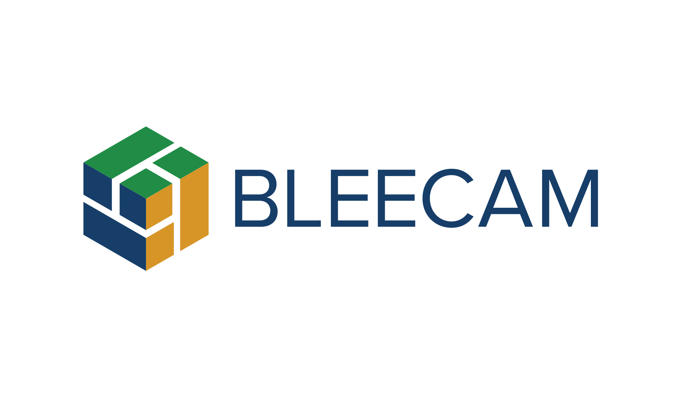
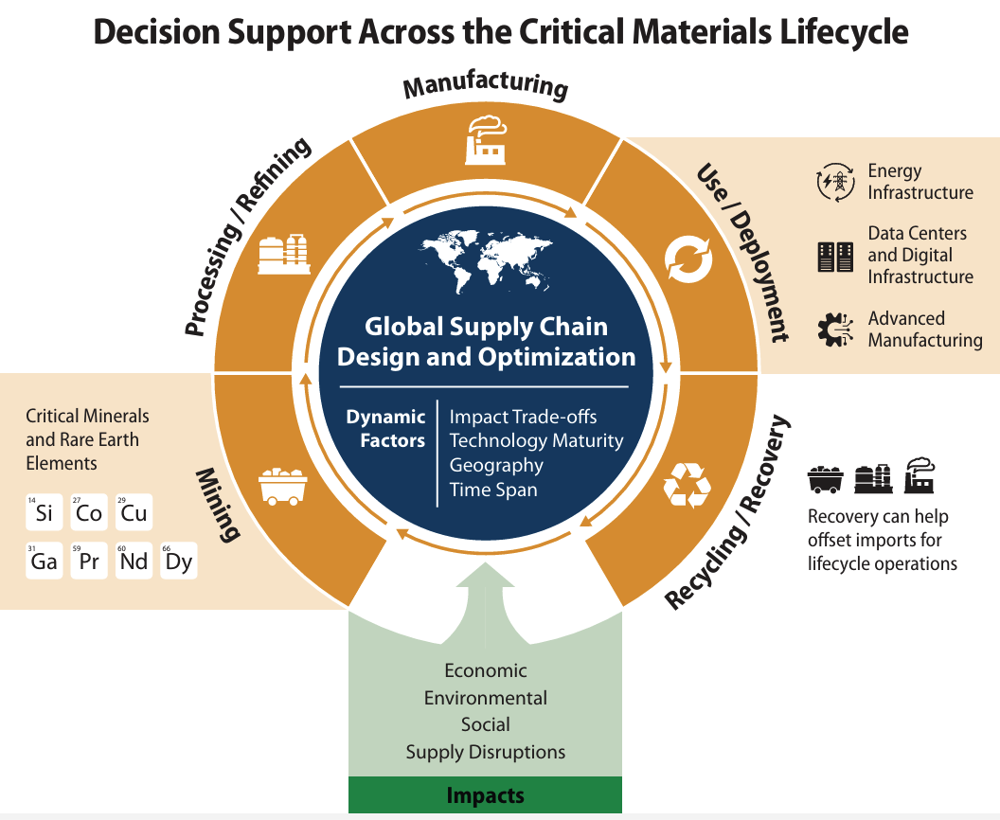

<p align="center">
  <picture>
    <source media="(prefers-color-scheme: dark)" srcset="docs/img/bleecam_logo_dark.svg">
    
  </picture>
</p>

# BLEECAM™

**Benchmarking Life Cycle Environmental, Economic, and Social Metrics for Critical and Advanced Minerals and Materials**

[](LICENSE)
[](DISCLAIMER.md)
[](https://github.com/NatLabRockies/bleecam/releases)
[](https://bleecam.readthedocs.io/en/latest/)

> **BLEECAM™ is a multi-objective optimization framework that benchmarks global critical-mineral supply chains across economic, environmental, and social dimensions — it evaluates and optimizes whole supply-chain *scenarios*, not single products.**

📖 **Documentation:** **<https://bleecam.readthedocs.io>**

> [!WARNING]
> **Public beta — `v0.1.0-beta.1`.** BLEECAM is released as a **beta** for transparency and community feedback. Public APIs, input data (the "golden inputs"), and numerical results may change between releases without notice. All outputs are **illustrative analytical results, not decision-grade guidance** for policy, investment, or operations — see the [DISCLAIMER](DISCLAIMER.md). Please report problems and suggestions via [GitHub Issues](https://github.com/NatLabRockies/bleecam/issues).

---

## Overview

BLEECAM is an **optimization-driven benchmarking and evaluation framework** for global critical-mineral and material (CMM) supply chains, developed at the **National Laboratory of the Rockies (NLR)** with funding from the **U.S. Department of Energy's Advanced Materials and Manufacturing Technologies Office (DOE AMMTO)**.

<p align="center">
  
</p>

Given a scenario — baseline, disruption, or policy — BLEECAM *solves* for the supply-chain configuration that best meets demand under real-world constraints (capacity, trade topology, tariffs, yields), and reports integrated **economic** (TEA/LCC), **environmental** (LCA-derived), and **social** (S-LCA) metrics for it, including the multi-objective trade-off frontier. It benchmarks technologies, routes, and countries against each other and against state-of-the-art references — giving DOE/AMMTO a prescriptive, quantitative basis for RD&D investment and supply-chain-resilience decisions.

### Why "optimization-driven benchmarking"

Most benchmarking is retrospective: you hand it fixed configurations and it grades them. BLEECAM benchmarks **prescriptively** — its engine is optimization, so it finds the best-achievable configuration under constraints and quantifies the trade-offs between objectives (for example, what buying down emissions costs in dollars, and vice versa). The optimization is the differentiator; the benchmarking is what it delivers.

### What BLEECAM is — and is not

BLEECAM is **LCA-integrating, not an LCA tool.** It *consumes* life-cycle impact factors as one of its three metric dimensions; it performs no inventory modeling and no impact characterization. Those factors come from a dedicated LCA engine — the first-party **LiAISON** engine, or any tool that emits to BLEECAM's documented emission-factor contract (e.g., **openLCA**). The goal, from the original proposal, was never to build another LCA tool, but to **apply LCA to critical minerals and establish defensible methods for LCA of CMMs** — alongside techno-economic and supply-chain analysis — to inform DOE/AMMTO.

---

## Key capabilities

- **Multi-objective optimization** across **economic**, **environmental** (any of ~25 ReCiPe / TRACI impact categories, GWP by default), and **social** (S-LCA: child labor, forced labor, injury) dimensions — single-objective corners and full multi-objective (AUGMECON2) Pareto trade-off frontiers.
- **Two demonstrated case studies** on structurally different supply chains: rare-earth permanent magnets (Nd / Dy) and gallium semiconductor wafers (GaN / GaAs).
- **Engine-agnostic LCA integration** via a documented emission-factor contract, with a reproducible first-party **LiAISON** adapter that carries full provenance.
- **Scenario analysis** — baseline, supply-shock (e.g., export restrictions), and policy scenarios.
- **Reproducible by design** — golden-output regression tests for both cases; results traceable to versioned inputs.

---

## Current scope

Two critical-material supply chains essential to U.S. national security and clean-energy sectors:

| Case | Materials | Application |
|---|---|---|
| **Rare earths** | Neodymium (Nd), Dysprosium (Dy) | NdFeB permanent magnets |
| **Gallium** | Gallium (Ga) | GaN / GaAs semiconductor wafers |

Each is modeled end to end — primary acquisition, refining / separation, metal and specialty-alloy processing, subcomponent manufacturing, use phase, and end-of-life recycling.

---

## Add a new critical mineral

BLEECAM is **material-agnostic** — the two cases above are examples, not limits. To benchmark a different mineral (copper, nickel, lithium, cobalt, …), you describe its supply chain in a declarative case file and supply its data; you inherit the whole engine — the optimization, the no-code criticality constraint library, multi-objective analysis, and LCA integration.

**See [ADDING_A_MATERIAL.md](ADDING_A_MATERIAL.md) — evaluate a different critical mineral, as simple as 1‑2‑3.**

---

## Architecture

```
src/bleecam/
  core/     # shared engine: solver selection, data-contract schema,
            # objective primitives, multi-objective methods, LCA import
  cases/
    rare_earth/   # REE supply-chain model + AUGMECON Pareto
    gallium/      # Gallium supply-chain model + AUGMECON Pareto
  shared/   # generic reporting / visualization helpers
```

BLEECAM uses a `src/` layout on a Pyomo optimization core. Cases supply data and case-specific structure; the shared `core/` provides the optimization, objective, and LCA-contract machinery.

---

## Installation

```bash
python -m pip install -e .            # core install (Pyomo, pandas, ...)
python -m pip install -e ".[viz]"     # + plotting
python -m pip install -e ".[test]"    # + pytest, SALib
```

A math-programming solver is required (ipopt as used in published results; HiGHS / GLPK / CBC also supported via auto-selection).

## Quickstart

```bash
# Rare-earth and gallium cost-optimized baselines
bleecam-ree  --data src/bleecam/cases/rare_earth/data
bleecam-ga   --input-dir src/bleecam/cases/gallium/data/gallium --solver auto

# Gallium 3-objective Pareto (cost x GWP x child labor), needs ipopt + pyaugmecon
bleecam-ga-pareto --data src/bleecam/cases/gallium/data/gallium --out outputs/gallium_pareto --grid 50

# View the criticality-constraint library and run a scenario — no code required
bleecam-lib list
bleecam-run scenarios/gallium_china_shutdown.yaml
```

Run the regression suite with `pytest`.

---

## Methods & provenance

- **Positioning** — `docs/positioning.md`
- **Multi-objective methods** (the degeneracy argument; lexicographic vs. epsilon-constraint / AUGMECON) — `docs/methods_multiobjective.md`
- **Roadmap and core-refactor scoping** — `docs/`

> **Data status.** Environmental and social factors are supplied through the emission-factor contract. The bundled LCIA / S-LCA data is under active refinement and should be treated as **provisional** pending finalization; the optimization machinery is reproducible independent of the specific factor values.

---

## Research questions (DOE AMMTO)

1. **Technology benchmarking** — what are the environmental, economic, and social metrics of a new technology relative to established benchmarks?
2. **Material onshoring** — how much material flow is onshored into the U.S. over time through new technology investments (mining, refining, circularity)?
3. **Supply-chain disruption recovery** — under what conditions, at what cost, and with what configuration can U.S. demand be met through a disruption?

These evolve with DOE AMMTO feedback.

---

## Contributors

Sherif Khalifa, Tapajyoti Ghosh, Julien Walzberg, Luca Brown

---

## License

BLEECAM is distributed under the **GNU Affero General Public License v3.0 or later (AGPL-3.0-or-later)** — see [LICENSE](LICENSE).

Copyright © 2026 **Alliance for Energy Innovation, LLC**. All rights reserved.
Developed at the **National Laboratory of the Rockies (NLR)** with funding from **DOE AMMTO**. NLR Software Record: **SWR 25-125**.

### Contributing

Contributions are welcome. By opening a pull request you license your contribution under AGPL-3.0-or-later (GitHub inbound = outbound). We also ask contributors to submit a short Contributor License Agreement — see **[CONTRIBUTING.md](CONTRIBUTING.md)** and **[CLA.txt](CLA.txt)**.

---

## Trademark

**BLEECAM™** is a trademark of the Alliance for Energy Innovation, LLC / National Laboratory of the Rockies. Use the ™ symbol on the first written reference to the tool.

---

## Acknowledgments

This work is led by the **National Laboratory of the Rockies (NLR)** with support from **DOE AMMTO**. Data and insights from the **U.S. Geological Survey (USGS)** and DOE stakeholders inform BLEECAM's development.

<!--
IMAGE ASSETS — place these files (not yet in the repo):
  docs/img/bleecam_logo.png       primary logo/wordmark for the header
  docs/img/bleecam_lifecycle.png  the "Decision Support Across the Critical Materials Lifecycle" figure
See README notes for recommended logo format.
-->
